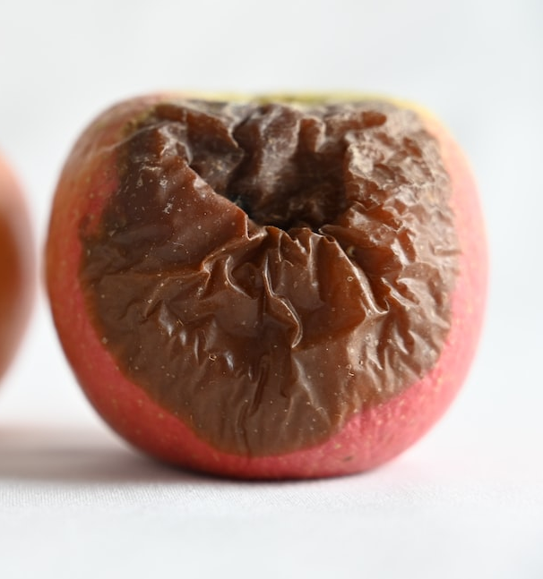

# Fruit Quality Check Service

This is a part of the final project of Hanna Kondrashova at the University of London.

This repository contains an HTTP service that is capable of processing pictures
and outputting the coordinates of several types of objects:
- Rotten apple
- Good apple
- Storage containing a large amount of apples that are difficult to distinguish

__NOTE__: The training pipeline is in [QualityCheckTrain](https://github.com/hannakond/QualityCheckTrain) repository.

## Prerequisites

To run the backend application perform the following steps:

1. Setup CUDA >= 11.0 following [the official guide](https://docs.nvidia.com/cuda/cuda-installation-guide-linux/).
Ultimately, you need an AWS or Google Cloud instance with a GPU having ~7GB of memory to run the service with near real-time latency. For lower performance, less GPU memory is acceptable.

Inference on CPU is much slower, but it can still be used for applications that do not have strict latency restrictions.

2. Clone the repository:

```bash
$ git clone git@github.com:hannakond/QualityCheck.git
```

After that, clone submodules and LFS objects:

```bash
$ git lfs pull
$ git submodule init
$ git submodule update
```

3. Activate virtual environment. Under Ubuntu, run:

```bash
$ sudo apt-get install virtualenv
$ virtualenv venv
$ source venv/bin/activate
```

It is assumed that Python >= 3.8 is installed in the system. Otherwise, you need to specify python to `virtualenv`:

```bash
$ virtualenv --python=<path to python >= 3.8> venv
```

4. Using activated virtual environment, run:

```bash
$(venv) pip install -r requirements.txt
$(venv) pip install -r yolov5/requirements.txt
```

## Run service

Inside virtual environment:

```bash
$(venv) python quality_check.py
```

## Run visual test

Inside virtual environment:

```bash
$(venv) python quality_check.py
```

Then, in a separate terminal:

```bash
$(venv) python test_viz.py --filename <image to process>
```

For example, running the following command:

```bash
$(venv) python test_viz.py --filename assets/apple_green_red_in.png
$(venv) python test_viz.py --filename assets/example_storages_in.png
$(venv) python test_viz.py --filename assets/rotten_in.png
```

will produce the following result:


|Input|Output|
|-----|------|
|||
|||
|||

## Logging

HTTP requests, debug information and more are shown in the terminal
running both test and the server part. Also, the log is saved in `log.txt`,
that is updated dynamically.

For example, a request related to one of the examples above, will
produce the following output:

```
2023-03-25 16:34:53,612 root         INFO     c7ab2949-8515-4cdc-af95-1e641a2ee644	BEGIN	method = POST	request path = /detect
2023-03-25 16:34:53,645 root         INFO     c7ab2949-8515-4cdc-af95-1e641a2ee644	END	esponse time = 0.03280s	status code = 200
2023-03-25 16:34:53,647 root         INFO     class_name storage, bbox [126, 198, 310, 297]
2023-03-25 16:34:53,659 root         INFO     class_name storage, bbox [0, 231, 104, 311]
2023-03-25 16:34:53,659 root         INFO     class_name storage, bbox [320, 204, 455, 296]
2023-03-25 16:34:53,659 root         INFO     class_name storage, bbox [23, 182, 140, 227]
2023-03-25 16:34:53,660 root         INFO     class_name storage, bbox [191, 145, 399, 192]
```

The first two lines are related to the server processing the request within
`time = 0.03280s`, and the last lines are the output logged from the client,
i.e. `test_viz.py`.
